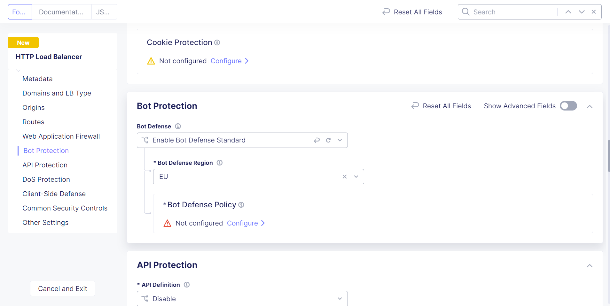
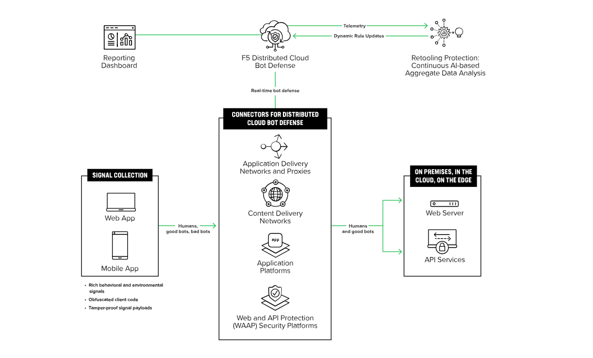
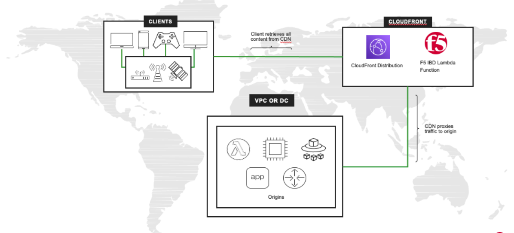

# F5 Bot defence 
<!-- Diskover -->
## Prečo sa sa zamerať na ochanu proti Botom ?
Ochrana proti botom je kritickým aspektom bezpečnosti siete, a existuje niekoľko dôvodov, prečo by ste sa mali zamerať na túto oblasť.

- Prevencia DDoS útokov: Boty často súčasťou distribuovaných útokov na službu (DDoS). 

- Ochrana webových aplikácií: Boty môžu byť využívané na neoprávnený prístup a škodlivé aktivity voči webovým aplikáciám. 

- Manažment botov: Nie všetky boty sú škodlivé. Je potrebné správne identifikovať a manažovať boty na základe ich aktivity a vedieť rozlíšiť škodlivých a legitímných botov.

- Dôležitá súčasť bezpečnostných politík: Ochrana proti botom je kľúčovou súčasťou širšieho bezpečnostného rámca. Integrácia do vašich celkových bezpečnostných politík pomáha zabezpečiť konzistentné a spoľahlivé riešenia.

- Snímanie a analýza botovej aktivity: Tieto informácie môžu byť využité na vytváranie správ a reakcií na nové vývojové hrozby.

- Ochrana pred stratou údajov: Boty môžu byť využívané na šírenie malvéru, krádež údajov alebo iné kybernetické hrozby. Je potrebné pomôcť chrániť citlivé údaje pred neoprávneným prístupom a distribúciou.

- Zabezpečenie API: V súčasnej digitálnej ekonómii sú API často terčom botov. Je potrebné poskytovať ochranu API prostredníctvom rôznych bezpečnostných funkcií, vrátane identifikácie a prevencie botov.

- Infraštruktúrne náklady: Často aktivity škodlivých botov nám nahltia zdroje pre prevádzku našej infraštruktúry v cloude, alebo licenčné obmedzenia v onprem. 

- Automatizovane podvody: Sofistifikovaní útočníci sa zameriavajú na biznis logiku zákaznikov. Snažia sa prenastaviť nástroje, aby boli voči bežným mitigačným technikám bezcenné. Vediet to k podvodom a znižuje to dôverihodnosť u zákaznika a reputácií značky. 

<!-- Learn -->

## Porovnanie funkcionalít na ochranu proti botom cez F5 riešenia
- XC základný balíček - detekcia a blokovanie na základe BOT signatúr. 
- NGINXplus App protect - Anti Automation  modul(Bot Mitigation) 
- BIGIP ako súčasť AWAF - pokročilá ochrana voči botom pomocou signatúr a aj pomocou overovaním klienta (CSID - javascriptu). 
- XC Bot Defence balíček - (bývalý Shape) - Vlajková loď F5-tky na ochranu proti Bot-om. https://www.f5.com/cloud/products/bot-defense

### Hlavné prednosti pokročilej ochrany proti Botom cez F5 XC 

- Jednoduchosť inštalácie:
    Predkonfugurované zjednodušené integrácie s onprem a cloud architektúrou.
- ML a behaviorálne analýzy:
    Poskytujú najefektívnejšie pokročilé analýzy s takmer nulovou chybnou detekciou.
- Ochrana API, web a mobilnými aplikáciami:
    Zlepšujú používateľskú skúsenosť ochranou pre zákazníkov z viacerých zdrojov.
- Vysoko obfuskovaný zdrojový kód:
    Pokročilá obfuskovanie kódu, chráni voči reverzného inžinieringu a obchádzaju zbieraniu kódu.  

## Ako nakonfigurovať  ochranu proti Botom na cez F5-tku ? 

1. Základná ochrana sa dá realizovať: 
    - BIGIP ako súčasť licencie Adwance WAF modulu
    - NGINXplus App protect - Anti Automation (Bot Mitigation) 
    https://docs.nginx.com/nginx-app-protect-waf/configuration-guide/configuration/#anti-automation-bot-mitigation
    - XC ako súčasť WAAP v základnom balíčku je ochrana proti botom na základe Bot signatúr 

2. Pokročilá Bot ochrana v Distributed Cloud
    - BIGIP a integrácia so Advanced Bot Defence balíčkom v XC (Distributed Cloud)
    - XC Advanced Bot Defence baliček 
 

### Integrácia XC Bot Defence a BIGIP 
- verzia 16.X  pomocou iAPPs templatoch 
- verzia 17.X pomocou integrovaného modulu XC Distributed Cloud Bot defence 
https://community.f5.com/t5/technical-articles/leverage-big-ip-17-1-distributed-cloud-services-to-integrate-f5/ta-p/310464

### Integrácia XC Bot Defence a AWS 
https://community.f5.com/t5/technical-articles/f5-distributed-cloud-bot-defense-protecting-aws-cloudfront/ta-p/303203

<!-- Try -->

## Užitočné videa a linky
- https://simulator.f5.com/s/bot_protect
- https://www.youtube.com/watch?v=6t35e16ZiA8
