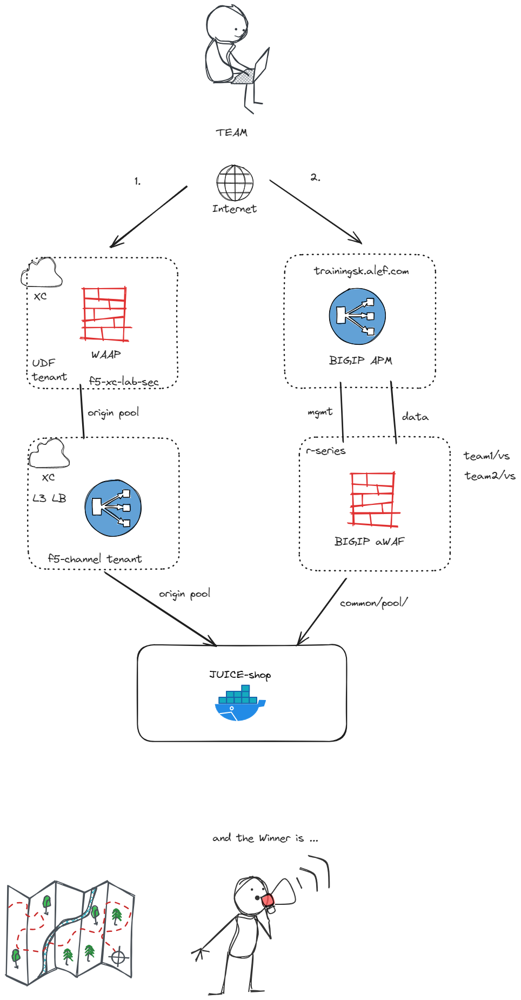
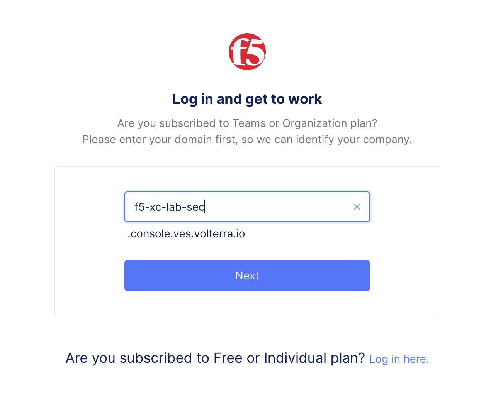
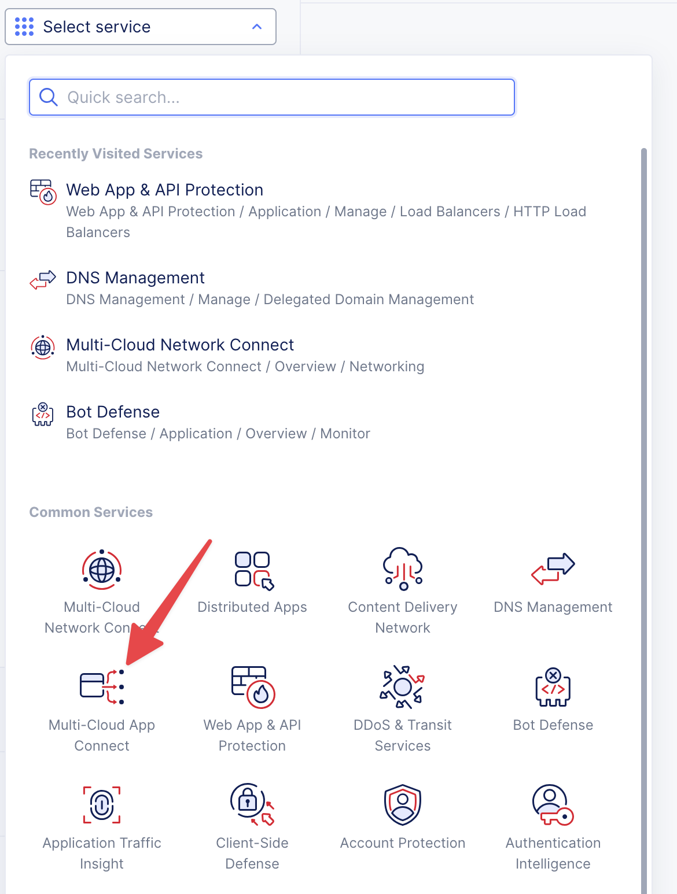
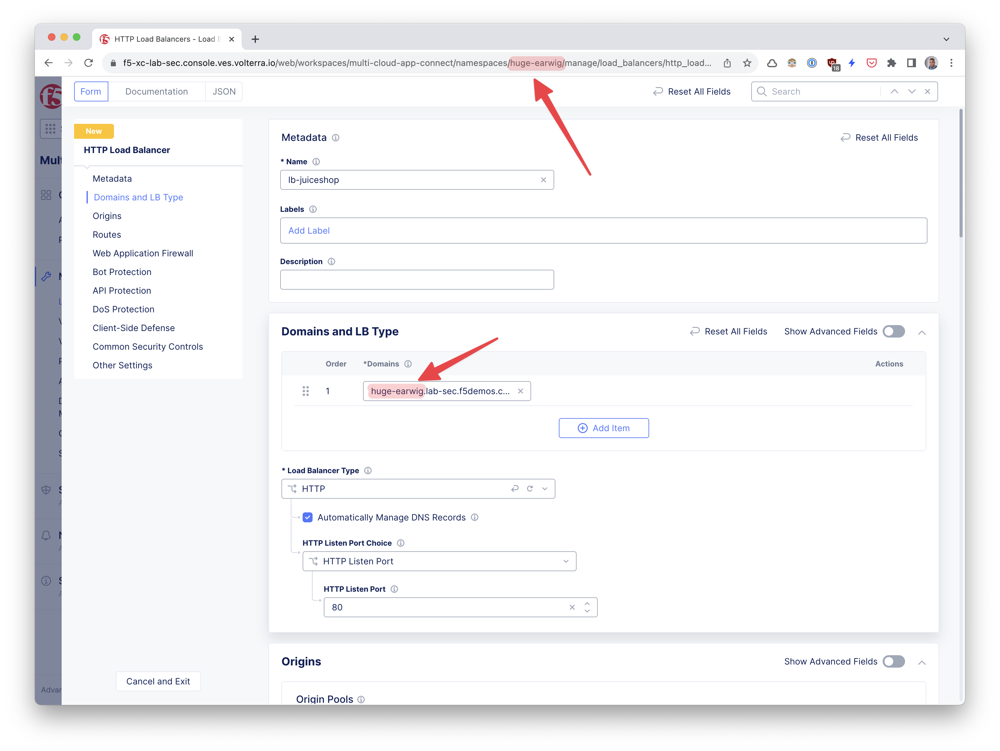
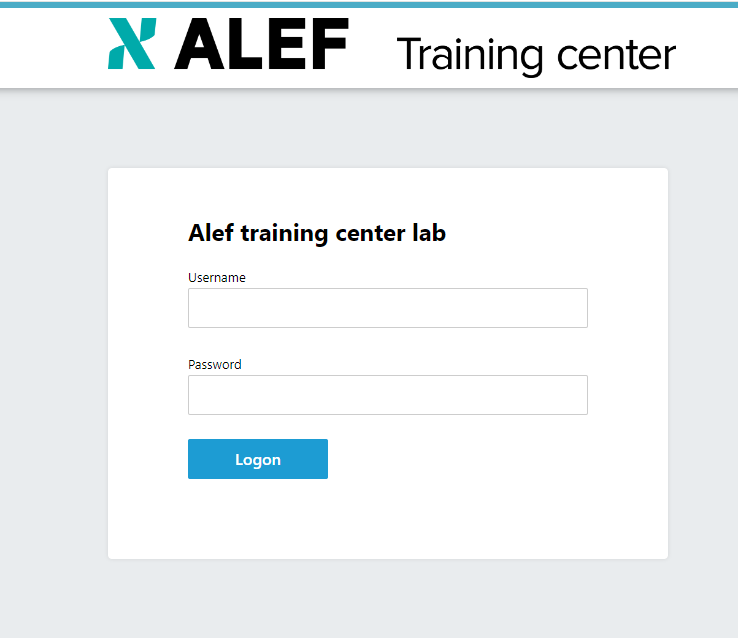
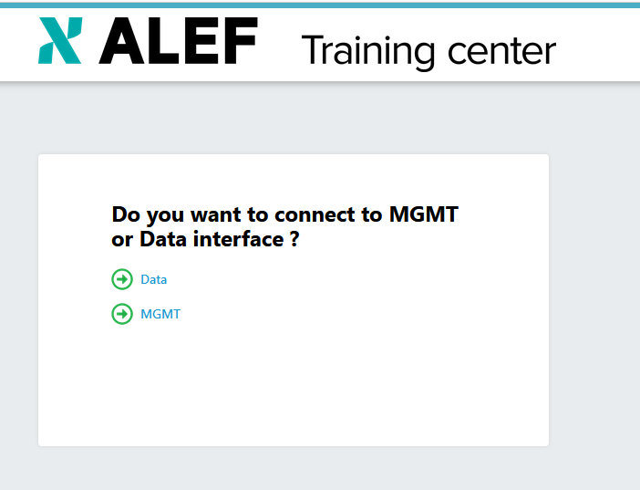

# OneWAF CTF Lab Guide 🚩


## CTF Scenario

### Topology

-   

### Steps

1. [Build F5 XC WAAP tenant](#F5-XC-WAAP-Tenant) in order to be able to participate in this part of the challange.
2. Get familiar with the protected app -> [Juice Shop](https://owasp.org/www-project-juice-shop/)
3. Plan your **WAAP** strategy
4. [Test](#test-the-app) that the apps are accessible
5. Protect the app using *F5 XC*
6. Protect the app using *BIG-IP WAF* 
7. Use **Client**  to verify your security policy. 
8. Ask the trainer for the evaluation!


### Notes

- 🛠️ You can use any available feature of *BIG-IP* or *XC* in order to protect the application, however the app *MUST stay accessible to regular users*!
- 👾 The evaluation will be done in the automated way using scripts and web browser to test security policy - *not all the vulnerabilities in the Juice Shop app will be tested!*
- ↩️ Before the evaluation the Juice Shop app will be restarted in order to reset any detected vulnerabilities triggered during the policy building
- 🙋🏻‍♂️ Reach out to the trainer when you are done, as *the best time counts*!


### Results 🥇

We will have the following categories:

1. **App Defender**!
   - best time and top mitigated vulnerabilities in both AWAF and F5 XC protections
2. **AWAF guru**!
   - best time and top mitigated vulnerabilities using AWAF
3. **Modern App Security**!
   - best time and top mitigated vulnerabilities using F5 XC


# !!!  Best time and top mitigated vulnerabilities is counted as *time* - (*each mitigated vulnerability = 2min*). !!! 


## Lab preparation

### F5 XC WAAP Tenant

### Distributed Cloud - XC 
- **F5 XC credentials**: `YOUR_EMAIL` / `YOUR_PASS` in **UDF**
  - Tenant: `f5-xc-lab-sec`

This Lab is using F5 XC SEC Lab as the starting point, so you can use the Lab Guide [here](https://clouddocs.f5.com/training/community/f5xc/html/class3/intro.html) to enable WAAP tenant or follow the guide below.

- F5 Distributed Cloud Console: https://f5-xc-lab-sec.console.ves.volterra.io/
- Delegated Domain: **lab-sec.f5demos.com**
- Account name: **f5-xc-lab-sec**

After following the invitation email’s instructions to **Update Password**, proceed to the first step below to access the F5 Distributed Cloud Lab Tenant.

1. Please log into the F5 Distributed Cloud Lab Tenant with your user ID (email) & password. https://f5-xc-lab-sec.console.ves.volterra.io/



1. When you first login, accept the Lab tenant EULA. Click the check box and then click **Accept and Agree**.

2. Select all work domain roles and click **Next** to see various configuration options. Roles can be changed any time later if desired.

3. Click the **Advanced** skill level to expose more menu options and then click **Get Started** to begin. You can change this setting after logging in as well.

4. Several **Guidance ToolTips** will appear, you can safely close these as they appear.

5. You can adjust your work domains and skill level (not required) by clicking on the

   **Account** icon in the top right of the screen and then clicking on **Account Settings**.

7. In the resulting window you can observe the **Work domains and skill level** section and other administrative functions.

8. Namespaces, which provide an environment for isolating configured applications or

   enforcing role-based access controls, are leveraged within the F5 Distributed Cloud

   Console. For the purposes of this lab, each lab attendee has been provided a unique

   **namespace** which you will be defaulted to (in terms of GUI navigation) for all tasks

   performed through the course of this lab.


## F5 XC LB

In order to be able to protect the JuiceShop in the UDF environment you have to configure the LoadBalancer with the parameters shown below.

Go to **Multi-Cloud App Connect**.



Click **Add HTTP Load Balancer**



Use `YOUR_NAME_SPACE` + `lab-sec.f5demos.com` as the domain name.

Configure **Origin Pool**

- Configure the **Origin Pool**

- each team use his own pool   
```
poolstudentX.ctf.kyberlabs.sk
```
- `X mean number of team` 
- `from 01, 02 .. 10`   
eg.  poolstudent02.ctf.kyberlabs.sk for team2    
     poolstudent10.ctf.kyberlabs.sk for team10  

```
port **111XX**        
```
- `X mean number of team` 
- `from 01, 02 .. 10`   
eg.  11102 for team2 
     11110 for team10 

- disable **TLS** towards Origin Server

**Save and Exit**


## Test the App

Go to **Client** -> **ACCESS** ->  **FIREFOX**

> You can use **Client** for testing of your security policy.


### BIG IP Adwance WAF 

- **BIG-IP credentials**: 
- [Training LOGIN PAGE ](https://trainingsk.alef.com)  `teamX` / `_securepasstobeannouced_`

- BIGIP LOGIN    `teamX` / `_samepasswordaslogin_`



- login to MGMT or DATA (protected VS) interface

  

- login to F5 BIGIP 


- create policy


**Client**:
  - FIREFOX
  - CHROME


If the app is not accessible please reach out to the trainer.
